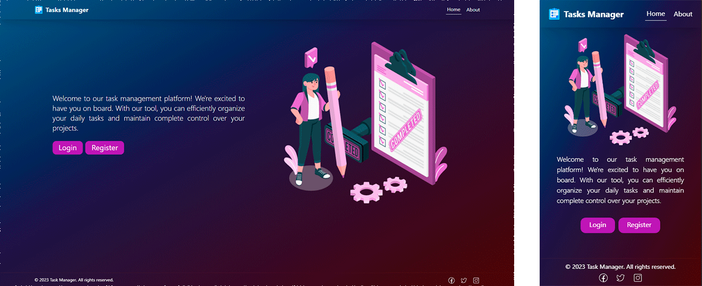
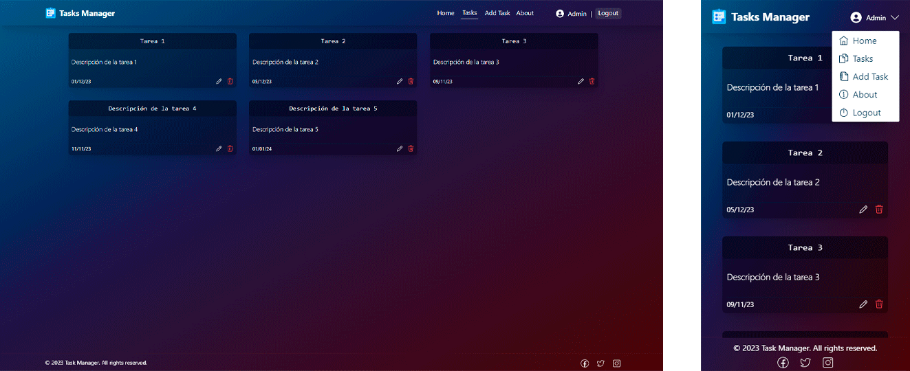

Backend - [AQUI 👉](https://github.com/drac-09/Task-backend-mern)

## Comandos

<table>
  </tr>
    <td>
      npm install
    </td>
    <td>
      Instalar dependencias de Node.
    </td>
  <tr>
  <tr>
    <td>
    npm run dev
    </td>
    <td>
    Inicia el servidor de desarrollo.
    </td>
  </tr>
</table>
 

# Tecnologías y Herramientas.

# Capturas de Pantalla.

